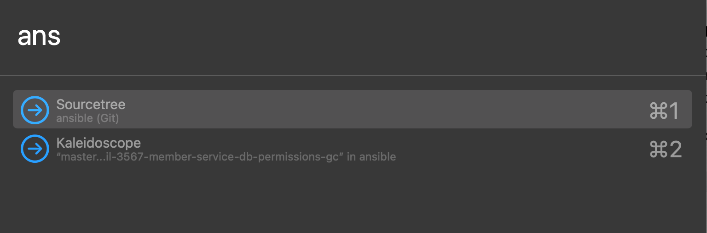
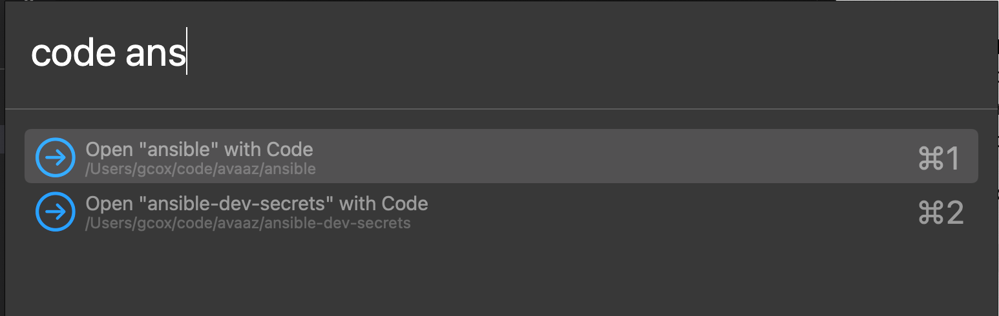

**Grant's Hammerspoon scripts**
Tested with Hammerspoon 0.9.93 (https://www.hammerspoon.org/)

**keyboardAppNav**
Used to switch between open windows by typing app / window name substrings, or to open a a folder in a specific app.  I mostly use this to switch to a specific service repo in either VSCode or Sourcetree:

* `ans` would show a list of all windows with "ans" anywhere in the title
* `code ans` will list Sourcetree windows with "ans", but also offer to open the "ansible" or "ansible-dev-secrets" repos in Sourcetree

